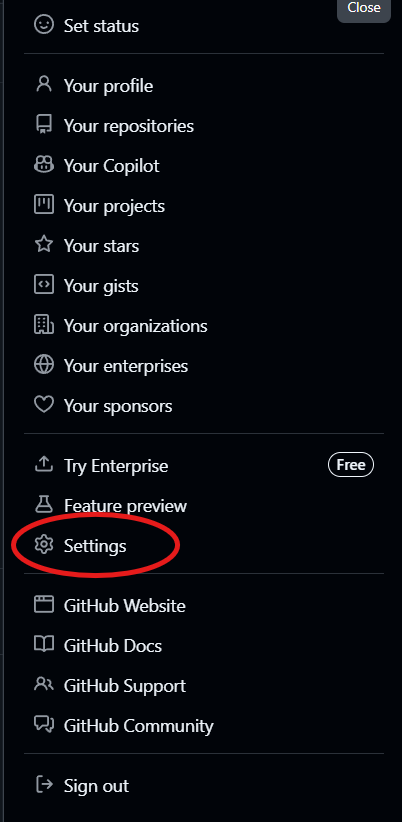
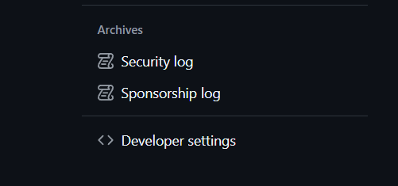
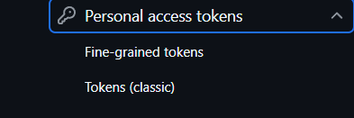
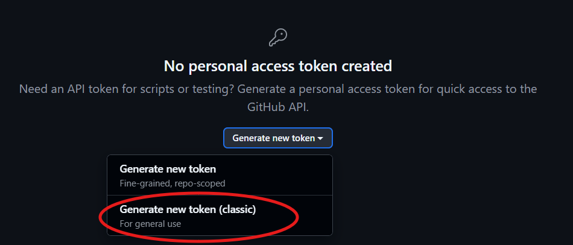
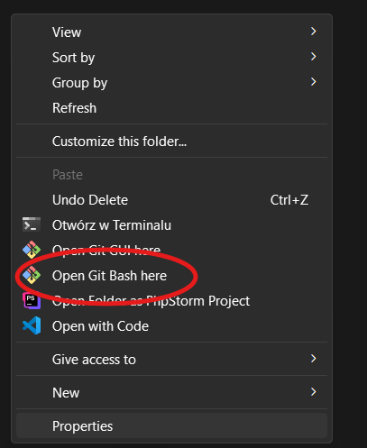

# Pobranie aplikacji

## Wygenerowanie klucza na GitHub

Aby sklonować repozytorium trzeba najpierw wygenerować klucz (token), który zostanie użyty do uwierzytelnienia

- Po zalogowaniu się na Github, należy rozsunąć panel z prawej strony i kliknąć Settings

  

- W ustawieniach, w panelu z lewej strony wybrać Developer settings

  

- Następnie rozwinąć zakładkę Personal access tokens

  

- Wybrać Tokens (classic) i kliknąć Generate token

  

## Instalacja Git i pobranie projektu

### Windows

- Należy pobrać Git Bash for Windows z [oficjalnej strony](https://git-scm.com/downloads/win) i zainstalować
- W wybranym folderze kliknąć prawy przycisk myszy i wybrać z menu kontekstowego Git Bash



- Sklonować repozytorium komendą

```bash
git clone https://github.com/DataScience360/Cursor.git
```

- Gdy pojawi się ekran logowania jako login trzeba podać email powiązany z kontem GitHub, a jako hasło użyć wcześniej wygenerowanego tokenu

### Linux

- Należy otworzyć terminal
- Odświerzyć lokalny indeks pakietów, aby mieć pewność, że zostanie pobrany najnowsza wersja Git:

```bash
sudo apt-get update
```

- Przejść w terminalu do wybranego folderu i sklonować repozytorium:

```bash
cd sciezka/do/folderu
git clone https://github.com/DataScience360/Cursor.git
```

- Gdy pojawi się ekran logowania jako login trzeba podać email powiązany z kontem GitHub, a jako hasło użyć wcześniej wygenerowanego tokenu
