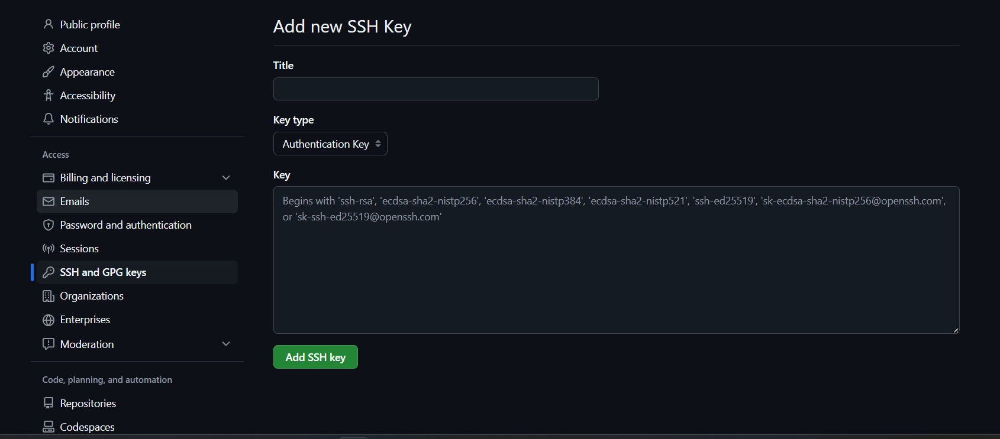

# Git

Zmiany projektu są śledzonę za pomocą systemu kontroli wersji Git.

```python
❯ ls -al
drwxr-xr-x@   - rich 22 Apr 09:12 .env
drwxr-xr-x@   - rich 22 Apr 14:39 .git
drwxr-xr-x@   - rich 18 Apr 07:23 confs
drwxr-xr-x@   - rich 22 Apr 14:28 docs
drwxr-xr-x@   - rich 22 Apr 09:28 scripts
drwxr-xr-x@   - rich 17 Apr 14:25 sites
.rw-r--r--@ 199 rich 22 Apr 09:28 .dockerignore
.rw-r--r--@  99 rich 22 Apr 10:10 .gitignore
.rw-r--r--@ 519 rich 22 Apr 12:23 compose.yaml
.rw-r--r--@ 227 rich 18 Apr 07:24 Dockerfile
❯ git status
On branch main
Untracked files:
  (use "git add <file>..." to include in what will be committed)
        docs/

nothing added to commit but untracked files present (use "git add" to track)
```

W celu zaciągania zmian w projekcie z repozytorium bez konieczności każdorazowej autenykacji można wygenerować klucz ssh

## Generowanie SSH

- Należy otworzyć terminal Linuxa lub Git Bash na Windowsie i użyć poniższej komendy, jako email dodając ten powiązany z kontem GitHub:

```bash
ssh-keygen -t ed25519 -C "your_email@example.com"ssh-keygen -t ed25519 -C "your_email@example.com"
```

## Dodanie wygenerowanego klucza ssh do ssh agent

### Windows

```bash
ssh-add c:/Users/YOU/.ssh/id_ed25519
```

### Linux

```bash
ssh-add ~/.ssh/id_ed25519
```

## Dodanie ssh do konta GitHub

- Należy użyć poleceń

```bash
ssh -T git@github.com
cat id_rsa.pub
```

- Otrzymany po wykonaniu komend klucz należy skopiować i dodać do konta GitHub (settings -> SSH and GPG keys -> new SSH key)

  

## Pobieranie zmian

Najnowsze wersje projektu można zaciągnąć z repozytorium przy pomocy poniższych poleceń wpisanych w terminalu Linuxa lub Git Bash

```bash
git fetch && git pull origin HEAD
```
