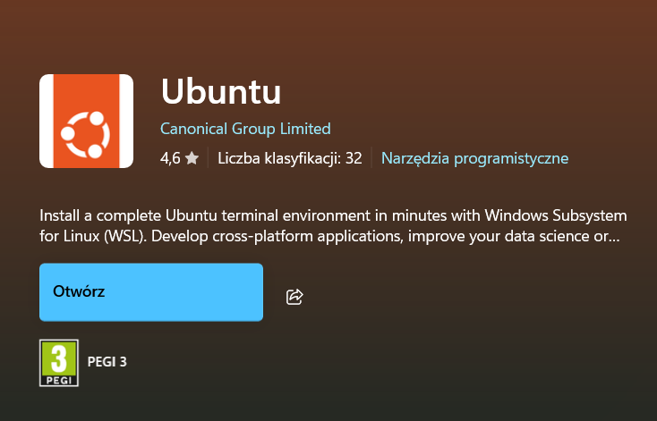

# Manualny start

Do uruchomienia aplikacji potrzebne są następujące narzędzia:

- Docker
- Docker compose
- W przypadku uruchomienia aplikacji na Windows - WSL (Windows Subsystem for Linux)

## Dodatkowe kroki dla Microsoft Windows

W przypadku korzystania z Windowsa, należy zainstalować najpierw WSL.
Można to zrobić na kilka sposobów:

- WinGet:
  - W najnowszych wersjach Microsoft Windows WinGet jest zainstalowany fabrycznie, jednak jeśli wersja Windows jest starsza niż 10, możliwe, że konieczne będzie zainstalowanie go samemu, można go pobrać z Microsoft Store
  - Uruchomić Windows PowerShell (najlepiej jako administrator) i wpisąć poniższą komendę:

```bash
winget install --id=Microsoft.WSL  -e
```

- Chocolatey:
  - Należy pobrać Chocolatey z [oficjalnej strony](https://chocolatey.org/install) i zainstalować
  - Uruchomić Windows PowerShell (najlepiej jako administrator) i wpisąć poniższą komendę:

```bash
choco install wsl2
```

- Lub pobrać WSL z Microsoft Store:
  <!--  -->
  

## Dodanie adresów ip do pliku hosts

### Windows

- Należy wejść w `C:\Windows\System32\drivers\etc`
- Następnie otworzyć plik hosts w dowolnym edytorze tekstu, a następnie wkleić poniższe adresy:

```
127.0.0.1 aplikacje121.local
::1 aplikacje121.local
127.0.0.1 wysylki121.local
::1 wysylki121.local
127.0.0.1 wysylki121test.local
::1 wysylki121test.local
127.0.0.1 eventyb.local
::1 eventyb.local
127.0.0.1 filesbat.local
::1 filesbat.local
127.0.0.1 rekrutacje121.local
::1 rekrutacje121.local
127.0.0.1 rozliczeniabat.local
::1 rozliczeniabat.local
127.0.0.1 rozliczeniatest.local
::1 rozliczeniatest.local
127.0.0.1 zamowieniabat.local
::1 zamowieniabat.local
127.0.0.1 zamowieniabattest.local
::1 zamowieniabattest.local
```

### Linux

- Należy uruchomić terminal i otworzyć plik hosts dowolnym edytorem tekstu np nano:

```bash
sudo nano /etc/hosts
```

- Następnie wkleić poniższe adresy:

```
127.0.0.1 aplikacje121.local
::1 aplikacje121.local
127.0.0.1 wysylki121.local
::1 wysylki121.local
127.0.0.1 wysylki121test.local
::1 wysylki121test.local
127.0.0.1 eventyb.local
::1 eventyb.local
127.0.0.1 filesbat.local
::1 filesbat.local
127.0.0.1 rekrutacje121.local
::1 rekrutacje121.local
127.0.0.1 rozliczeniabat.local
::1 rozliczeniabat.local
127.0.0.1 rozliczeniatest.local
::1 rozliczeniatest.local
127.0.0.1 zamowieniabat.local
::1 zamowieniabat.local
127.0.0.1 zamowieniabattest.local
::1 zamowieniabattest.local
```

## Dodanie pliku z backupem bazy do projektu

- Otworzyć konsolę Linuxa lub WSL na Windowsie
- Przejść do Cursora

```bash
cd sciezka/do/pliku/Cursor
```

- W przypadku korzystania z WSL należy na początku ścieżki dodać /mnt np:

```bash
cd /mnt/C/Users/.../Cursor
```

- Zainstalować narzędzie CURL

```bash
sudo apt install curl
```

- Z jego pomocą zainstalować task, który posłuży do dodania bazy do projektu

```bash
sh -c "$(curl --location https://taskfile.dev/install.sh)" -- -d -b ~/.local/bin
```

- Zainstalować zip, jeśli nie ma go na urządzeniu

```bash
sudo apt install unzip
```

- Rozpakować zip dumpu bazy danych
- zainstalować kompresor xz i zdekompresować plik

```bash
sudo apt install xz-utils
tar -xvf Cursor.tar.xz
```

- Wywołać wcześniej pobrany task

```bash
task
```

- Jeśli komenda nie zadziała dodać:

```bash
export PATH="~/.bin:$PATH" >> ~/.bashrc
source ~/.bashrc

```

## Dodanie zmiennych środowiskowych

W celu wygenerowania lokalnie odszyfrowanych zmiennych środowiskowych należy użyć komendy poniższej z poziomu głównego folderu projektu (Cursor), po czym wpisać hasło do Ansible Vault przekazane przez DS360.

```bash
ansible-playbook generate_env.yml --ask-vault-pass
```

Po wykonaniu się task-ów w playbook-u, pliki ze zmiennymi środowiskowymi powinny znajdować się w .env_files/development

## Uruchomienie aplikacji

### Instalacja dockera

Przed wykonaniem dalszych kroków należy zainstalować Dockera

#### Windows

Plik instalacyjny dockera można pobrać z [oficjalnej strony](https://docs.docker.com/desktop/setup/install/windows-install/) lub z Microsoft Store

#### Linux

- W konsoli Linuxa:

```bash
sudo apt-get update
sudo apt-get install ./docker-desktop-amd64.deb
```

### Uruchomienie

Z poziomu katalogu w którym znajduje się plik `compose.yml` aplikacja może zostać uruchomiona za pomocą poniższej komendy:

```bash
docker compose up
```

- Jeśli komenda nie zadziała, można spróbować wcześniej uruchomić docker desktop

Poprawne uruchomienie aplikacji powinno wyświetlić następujące informacje:

```bash
[+] Running 2/2
 ✔ Network oexcursor_default  Created                                                                         0.1s
 ✔ Container oexcursor-web-1  Created                                                                         0.1s
Attaching to web-1
web-1  | [Tue Apr 22 12:22:41.212074 2025] [mpm_prefork:notice] [pid 7] AH00163: Apache/2.4.41 (Ubuntu) PHP/8.1.32 configured -- resuming normal operations
```

Plik `/etc/hosts` powinien zawierać translację ścieżek w następującej postaci:

```python
───────┬───────────────────────────────────────────────────────────────────────
       │ File: /etc/hosts
───────┼───────────────────────────────────────────────────────────────────────
   1   │ ##
   2   │ # Host Database
   3   │ #
   4   │ # localhost is used to configure the loopback interface
   5   │ # when the system is booting.  Do not change this entry.
   6   │ ##
   7   │ 127.0.0.1       localhost
   8   │ 255.255.255.255 broadcasthost
   9   │ ::1             localhost
  10   │
  11   │
  12   │ 127.0.0.1       aplikacje121.local
  13   │ 127.0.0.1       wysylki121.local
  14   │
  15   │ ::1    aplikacje121.local
  16   │ ::1    wysylki121.local
  17   │
───────┴───────────────────────────────────────────────────────────────────────
```

Następnie kierując się za pomocą przeglądarki internetowej na adres np. `http://aplikacje121.local`. Powinniśmy zobaczyć stronę głowną tej aplikacji.
