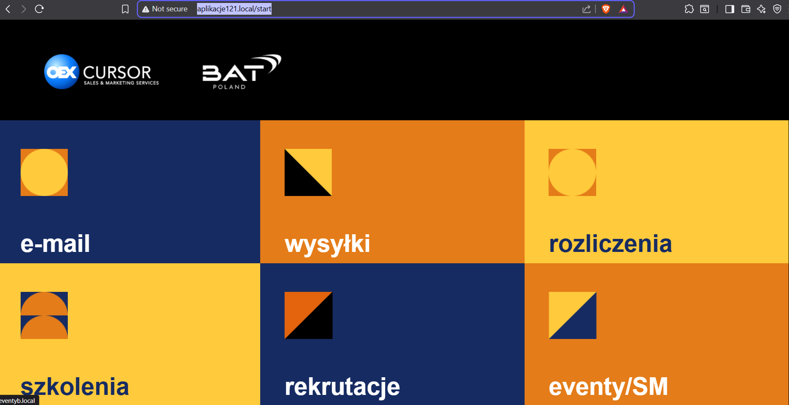
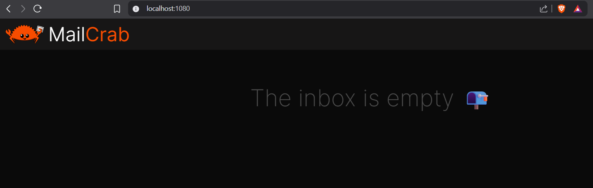

# korzystanie z aplikacji

Po udanym uruchomieniu aplikacji, aby z niej skorzystać należy w przeglądarce wyszukać `http://aplikacje121.local/start`

Poruszanie się po aplikacji wymaga logowania, hasłem jest `Admin?123`

## Mail Sender

W celu skorzystania z funkcjonalności MailCrab symulującej działanie skrzynki mailowej należy dostać się poprzez `localhost:1080`

